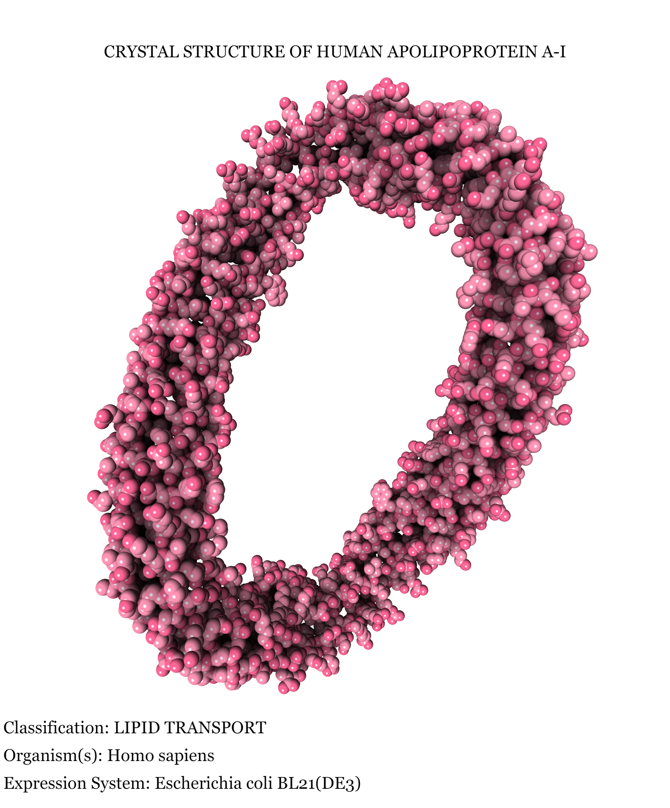

## 1. Название ПО и ссылку на выбранную структуру белка

**Моё ПО:** Protein Imaging (https://3dproteinimaging.com/protein-imager/)  
**Мой белок:** 1AV1 (https://www.rcsb.org/structure/1AV1)  
Моё ПО - готовый сайт, ничего скачивать не надо, интерфейс приятный.  
Я приложил документацию в файл documentation.pdf  

На главном экране надо приложить pdb файл (1AV1.pdg), а для скачивания изображений на сайте надо зарегистрироваться. Все остальные сложности я создавал себе сам.

## 2. Полученные изображения белка с различными визуализациями в файлах в графическом формате (.png, .jpg, …)
**Все изображения находятся в папке photos_task5.**

## 3. Описание способа получения визуализации в выбранном ПО....
**На моём сайте визуализации менялись таким образом**: справа окно structures, снизу под надпись "selections" глазик и значок настройки, а при нажатии на него уже открываются варианты (их названия отличаются от тех, которые у нас по заданию, но с помощью документации всё понятно).  

По цветовой раскраски я везде в этом задании использовал ту, которую предлагают изначально, то есть "**color uniform**". **Всегда работал с отображением "real" на сайте**.

1) Wireframe  
На моём сайте необходимо выбрать вариант "Stick".  
В этой визуализации каждый атом белка представлен как сфера, их соединяют линии, образующие структурную сетку. Это позволяет увидеть общую форму белка и расположение его атомов, но не предоставляет детальной информации о их типе или химической структуре.  
[wireframe.png](photos_task5%2Fwireframe.png)  

2) Backbone  
На моём сайте необходимо выбрать вариант "Tube".  
Визуализирует только основную цепь белка, обозначая каждый аминокислотный остаток как линию, соединяющую углероды атомов в каркасе белка. Это подчеркивает общую структуру и укладку белка, игнорируя боковые цепи.  
[backbone.png](photos_task5%2Fbackbone.png)  

3) Spacefill  
На моём сайте необходимо выбрать вариант "Sphere".  
В этой визуализации каждый атом белка представлен как шар, размер которого пропорционален его ван-дер-Ваальсову радиусу. Это позволяет видеть объемную структуру белка и взаимное расположение его атомов.  
[spacefill.png](photos_task5%2Fspacefill.png)  

4) Ribbons  
На моём сайте необходимо выбрать вариант "Cartoon".  
Визуализирует белок в виде непрерывной ленты, представляющей основную цепь. Цвета и форма ленты могут представлять различные элементы вторичной структуры белка, такие как α-спирали, β-листы и петли. Это помогает визуализировать связь между структурными элементами белка.  
[ribbons.png](photos_task5%2Fribbons.png)  

5) Molecular surface  
На моём сайте необходимо выбрать вариант "Surface".
Эта визуализация представляет белок как набор изолиний, обозначающих различные уровни поверхности белка. Она позволяет увидеть доступные для взаимодействия участки белка, такие как активные участки или места связывания с другими молекулами.  
[molecular_surface.png](photos_task5%2Fmolecular_surface.png)  

### Выполнить раскраску структуры
**Эти изображения находятся в папке photos_task6**
1) Цветовой моделью CPK  
На моём сайте для этого достаточно выбрать формат "color" справа от названия визуализации, которую вы выбрали.  
Тут я решил использовать "Sphere" и СРК соответствует "color by element".  
[sphere_colorByElement.png](photos_tak6%2Fsphere_colorByElement.png)  

2) Различными цветами по доменам (частям) белка  
Тут надо выбрать "color by moiety" и я оставил тут wireframe визуализацию.  
[Wireframe_colorByMoiety.png](photos_tak6%2FWireframe_colorByMoiety.png)  

## 4. Ваше изображение белка публикационного качества
У меня сайт уже позволяет просто сохранять изображения в хорошем качестве, причём в png и jpg разрешениях.  
Я просто зашёл в онлайн редактор фото и добавил подходящих надписей с описанием.
В папке этого задания у меня есть и png и jpg варианты изображения. Под разные ситуации и стили разные подойдут.

