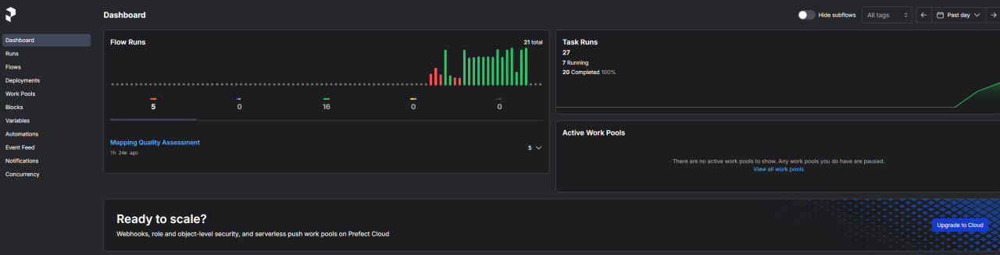

# Задание 4

1. **Ссылка на загруженные прочтения**: Я взял Escherichia coli [и её SRR31202530](https://www.ncbi.nlm.nih.gov/sra/SRX26583540%5Baccn%5D)
2. **Скрипт bash с реализованным алгоритмом**: файл `quality_check.sh`
- запускать его надо через WSL, то есть в моём случае это:
```
wsl bash /mnt/c/Users/Dom/Desktop/bioinformatics/task4/quality_check.sh
```
- Результат работы находится в файле `flagstat_output.txt`
3. **Результат команды samtools flagstat**: находится в файле `flagstat_output.txt`
4. **Питон-скрипт для парсинга этих данных**: файл `parse_flagstat.py`
5. **Файлы остались на WSL**
6. **Инструкция по развёртыванию и установке фреймворка Prefect**:
    - ### Установка Prefect
    ```bash
    pip install prefect
    ```
    - ### Запуск локального сервера Prefect
        1. Запускаем себе локальный сервер с приятным интерфейсом:
           ```bash
           prefect server start
           ```
        2. Получаем в консоль такой вывод
        ```
      |  _/   / _|| _|| _| (__  | |
      |_| |_|_\___|_| |___\___| |_|
      Configure Prefect to communicate with the server with:
      prefect config set PREFECT_API_URL=http://127.0.0.1:4200/api
      View the API reference documentation at http://127.0.0.1:4200/docs
      Check out the dashboard at http://127.0.0.1:4200
        ```

    - ### Работа с сервером
        - Перед запуском любого кода который работает с perfect надо локально сначала писать 
        ```
      $env:PREFECT_API_URL = "http://127.0.0.1:4200/api"
        ```

7. **Код тестового пайплайна ("Hello world") на фреймворке**: файл `hello_world_pipeline.py`
8. **Результат работы пайплайна на фреймворке и лог-файлы**: см. файл `pipeline_results.txt` - это логи из файла `quality_pipeline.py` для 10 пункта
9. **Скриншот сервера**: Весь интерфейс находится в папке server_interface: 
10. **Код пайплайна “оценки качества картирования” на фреймворке**: файл `quality_pipeline.py` 
11. **Результаты работа пайплайна**, абсолютно со всеми логами, находятся в файле `flagstat_output_pipeline.txt`
12. **Лог-файлы работы пайплайна** находятся в файле `pipeline_log.txt`, также логи которые экспортируются с сервера `arcane-starling.csv` 
13. **Визуализация пайплайна** в виде графического файла: скриншот с сервера `perfect_run_summary.jpg`
14. **Описание использованного способа визуализации** и отличия полученной визуализации от
    блок-схемы алгоритма в свободной форме: Моя схема с сервера показывает последовательный порядок выполнения моих питон функций
    DAG в данном случае состоит из двух задач:
- **run_flagstat** — выполняет команду `samtools flagstat` и создает файл `flagstat_output_pipeline.txt`.
- **analyze_flagstat** — анализирует данные из `flagstat_output_pipeline.txt` и вычисляет процент картированных ридов.

- ### Отличия от блок-схемы
- **Зависимости**: В блок-схеме обычно представлены шаги, где каждая задача идёт последовательно, вне зависимости от реальных зависимостей. В DAG каждая задача выполняется только после завершения тех, от которых она зависит, и это автоматически отслеживается системой.
- **Параллелизм**: В случае сложных пайплайнов DAG позволяет выполнять независимые задачи параллельно, что невозможно с линейной блок-схемой.
- **Отсутствие циклов**: В DAG невозможно создать циклы, что важно для предотвращения бесконечного выполнения. Блок-схемы могут содержать циклы, например, при использовании конструкций `for` или `while`.
- **Гибкость и динамичность**: В Prefect Server DAG может динамически отслеживать выполнение задач и перезапускать их при сбоях. Блок-схема не предоставляет такой гибкости.

В моём случае DAG в Prefect показывает простую линейную структуру.

