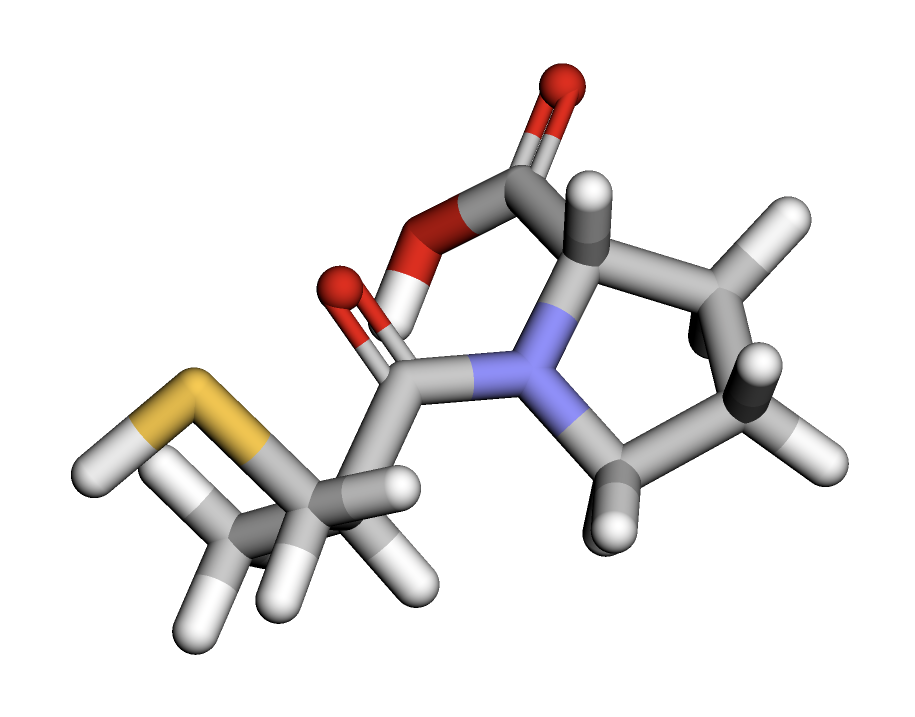

# Домашнее задание 6. Докинг лекарственных молекул

## 1. Общая информация о препарате

**Наименование препарата:** Катоприл  
**Область применения:** применяется для лечения заболеваний сердечно-сосудистой системы, в частности: 
1. Артериальная гипертензия (снижение высокого кровяного давления). 
2. Сердечная недостаточность (в составе комбинированной терапии). 
3. Диабетическая нефропатия (для защиты почек при сахарном диабете). 
4. Инфаркт миокарда (для улучшения функции сердца после приступа).  

**Молекулярный механизм действия:** является ингибитором ангиотензин-превращающего фермента (АПФ).

**Краткое объяснение механизма:**
1. АПФ отвечает за превращение ангиотензина I в ангиотензин II. 
2. Ангиотензин II — это мощное вещество, вызывающее сужение сосудов (вазоконстрикцию), повышение артериального давления и стимуляцию выработки альдостерона (гормона, задерживающего натрий и воду).
3. Каптоприл блокирует действие АПФ, снижая уровень ангиотензина II. 
4. Это приводит к расширению сосудов, уменьшению нагрузки на сердце, снижению артериального давления и улучшению работы сердца.

**А если просто:** Каптоприл помогает снизить давление и улучшить работу сердца, блокируя вещество, которое сужает сосуды. В норме это вещество заставляет сосуды становиться уже, а организм удерживать больше воды и соли, из-за чего давление повышается. Каптоприл останавливает этот процесс: сосуды расширяются, вода лишняя выводится, и давление падает. Это облегчает работу сердца.

## 2. Работа в google collab

Везде где можно вписываем свой "1O86".  
В 4 пункте вставляем свой SMILES.  
Вписываем свой keyword с RCSB, а именно "LPR".  
Результаты в папке `collab_result`, а сам гугл колаб на этом же уровне и называется `Misha_task6.ipynb`.

## 3. Полученные результаты докинга

Все результаты также находятся в папке `task6/collab_result/1O86/DOCKING/SIM`.

## 4. Изображения

Конечно, их всех лучше посмотреть в самом коллабе, но раз уж необходимо.  

1. Трёхмерная структура

2. Трехмерная структура исходного лиганда

3. Полученный бокс

4. Полученный докинг
